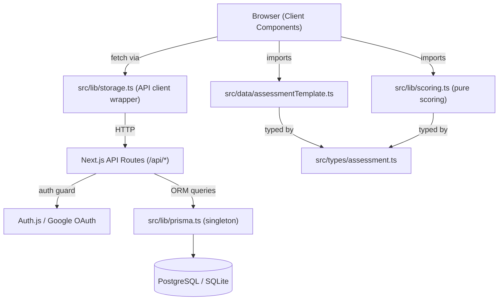

# Technical Reference - SWE Best Practices Pulse

Engineering guide for running, developing, and deploying the application.  
For product context and scoring definition see [PRODUCT.md](PRODUCT.md).

## Architecture

The app is a **static Next.js export** (`output: 'export'`). There is no server, no database, and no authentication.

- **Scoring:** Calculated client-side in `src/lib/scoring.ts` (pure functions).
- **Drafts:** In-progress answers auto-saved to `localStorage` via `src/lib/draftStorage.ts`.
- **Results:** After submission, `{ result, answers, submittedAt }` is written to `localStorage` under the key `assessment-result`. The dashboard reads from this key on mount.
- **Playbook:** Markdown file read from `content/playbook.md` at build time by the server component in `src/app/playbook/page.tsx`.

> **Legacy backend:** The `v1-with-backend` git tag preserves the version with Google OAuth, Prisma + Postgres persistence, and team sessions. Restoring it requires setting up environment variables and a Postgres instance.

## Stack

- Next.js 16 (App Router, TypeScript strict, `output: 'export'`)
- Plain CSS (no Tailwind)
- No authentication
- No database or ORM
- React Markdown for rendering maintainable content from versioned `.md` files

## Getting Started

1. Install dependencies:

```bash
npm install
```

2. Start the development server:

```bash
npm run dev
```

Open [http://localhost:3000/wz-int-swe-best-practices](http://localhost:3000/wz-int-swe-best-practices).

> Note: `basePath` is set to `/wz-int-swe-best-practices` in `next.config.ts` to match the GitHub Pages hosting path. The dev server reflects this.

## Building

```bash
npm run build
```

Produces a fully static site in the `out/` directory. No environment variables are required.

## Deployment

Pushing to `main` triggers the GitHub Actions workflow at `.github/workflows/deploy.yml`, which:

1. Runs `npm ci && npm run build`
2. Uploads `out/` as a GitHub Pages artifact
3. Deploys to `https://wizeline.github.io/wz-int-swe-best-practices`

The `public/.nojekyll` file prevents GitHub Pages from ignoring the `_next/` asset folder.

## Optional Configuration

- `NEXT_PUBLIC_MAX_RECOMMENDATIONS` (default: 1) — Number of action items to display per pillar in assessment results. Defined in `src/lib/config.ts`.

## Content-driven AI Tooling View

- Route: `/playbook`
- Source of truth: `content/playbook.md`
- Loader/parser: `src/lib/playbookContent.ts`
- Rendering: server-side page in `src/app/playbook/page.tsx` using `react-markdown`

The markdown file is intentionally grouped by `## Pillar ...` headings. Inside each pillar, use `###` for a playbook entry and `#### Do this`, `#### Why this works`, and `#### How to` for the colored guidance blocks. The parser keeps intro content separate and turns each pillar heading into a standalone section card so content editors can add or reorder guidance without touching React code.

## Local Docker Workflow

Start database container:

```bash
docker start swe-postgres
```

Stop database container:

```bash
docker stop swe-postgres
```

Remove database container (cleanup):

```bash
docker rm -f swe-postgres
```

## Scripts

```bash
npm run dev                 # development server
npm run build               # production build
npm run lint                # ESLint
npm test                    # unit tests (Vitest)
npm run test:watch          # tests in watch mode
npm run test:coverage       # coverage report
npm run prisma:generate     # generate Prisma client
npm run prisma:migrate:dev  # run local DB migrations
npm run prisma:migrate:deploy # run production DB migrations
```

## Deploying To Vercel

For production deploys, use a managed PostgreSQL database.

1. Set `DATABASE_URL`, `GOOGLE_CLIENT_ID`, `GOOGLE_CLIENT_SECRET`, and `AUTH_SECRET` in Vercel project environment variables.
2. Set `ADMIN_EMAILS` in Vercel if you want to enable the admin comparison page.
3. Deploy normally with Vercel CLI or Git integration.

This repository includes `vercel.json` with:

```bash
npx prisma migrate deploy && npm run build
```

That ensures migrations run before the Next.js build in production.

## Architecture



> **Key invariants**
>
> - `scoring.ts` is pure - no browser or server APIs
> - Score levels are dynamically derived from `maxScore` via `resolveScoreBands(maxScore)` using percentage bands: Foundational < 43%, Disciplined >= 43% and < 65%, Optimized >= 65% and < 85%, Strategic >= 85%
> - `Optimized` also requires every category score to be at least `2.5`; `Strategic` requires every category score to be at least `3.0`
> - `prisma.ts` owns the singleton Prisma client
> - `storage.ts` is the only client-side API caller - never query Prisma from components

## Project Structure

```text
prisma/
  schema.prisma
src/
  app/
    admin/                  # Admin-only cross-team comparison page
    api/                    # Route handlers for submissions, sessions
  components/
    assessment/             # UI components
    charts/                 # Recharts-based analytics components
  data/                     # assessmentTemplate.ts
  lib/                      # scoring.ts, storage.ts, prisma.ts
  types/                    # assessment domain types
```

## Data Persistence

Prisma models:

- `AssessmentSession` - owner-created team voting sessions with shareable codes
- `SessionParticipant` - explicit membership for users who have submitted into a team session
- `Submission` - completed assessments with full answer history

- Session owners can create and delete their own `AssessmentSession` records from the dashboard
- Users who vote inside a team session are recorded in `SessionParticipant`, which lets the dashboard list joined sessions even when the user no longer has the original `?session=CODE` URL
- Configured admins can access `/admin` to compare all sessions and inspect database-wide activity counts
- The admin report supports `from`, `to`, `sort`, and `page` query params for filtering, ordering, and pagination
- The admin report also renders always-visible analytics charts from the filtered session set: score-level distribution and filtered org pillar averages
- Team drilldown uses `/admin/team/[code]` and preserves active report filters in the URL for return navigation
- Team drilldown and the owner dashboard both render a radar chart comparing team pillar averages with the all-time org baseline
- `/api/sessions/org-averages` returns `{ categoryAverages: Record<string, number> }` for authenticated dashboard clients that need the org baseline without direct Prisma access
- Personal dashboard results can render a read-only questionnaire review directly from `Submission.answers` plus `src/data/assessmentTemplate.ts`; this applies to manual questionnaire submissions, not repository-analysis submissions that persist empty `answers`

`Submission` also stores denormalized metrics (`totalScore`, `maxScore`, `completion`, `scoreLevel`) to support more efficient reporting and future DB-level aggregations.

`CrossTeamComparison` now includes `orgCategoryAverages`, computed by averaging each session's pillar averages rather than every raw submission. This keeps the admin drilldown radar aligned with team-level comparison semantics.

All assessment data is scoped to the authenticated session email on the server.
Client components should use `src/lib/storage.ts`. Do not call Prisma directly from client-side code.

The read-only answer review surface lives in `src/components/assessment/AssessmentReview.tsx` and is mounted from `DashboardView.tsx` only for personal result contexts. Team owner aggregate views never expose participant question-by-question submissions.

## Validate

Run all three CI gates before opening a PR:

```bash
npm run lint
npm test
npm run build
```

## Where To Customize Content

| What                                            | File                             |
| ----------------------------------------------- | -------------------------------- |
| Questions, categories, weights, recommendations | `src/data/assessmentTemplate.ts` |
| Domain types                                    | `src/types/assessment.ts`        |
| Scoring logic                                   | `src/lib/scoring.ts`             |
| Reference prompt templates                      | `prompts/`                       |
| Agent / contributor rules                       | `AGENTS.md`                      |
