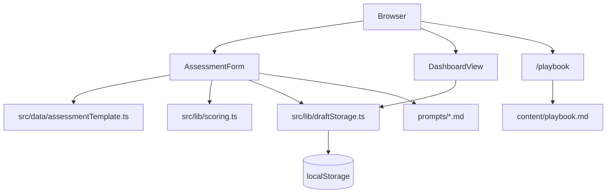

# Technical Reference - SWE Best Practices Pulse

Engineering guide for the current static self-diagnostic app.

## Architecture

The app is a static Next.js export deployed to GitHub Pages. It has no server runtime, database, authentication, API routes, or private environment variables.



## Runtime Behavior

- Scoring is calculated client-side by pure functions in [src/lib/scoring.ts](src/lib/scoring.ts).
- Draft answers and latest results are stored in browser `localStorage` through [src/lib/draftStorage.ts](src/lib/draftStorage.ts).
- The dashboard reads the latest local result on mount.
- The playbook is loaded from [content/playbook.md](content/playbook.md) at build time and rendered with `react-markdown`.
- Prompt files are bundled/read by the static app for copy/paste workflows.

## Stack

- Next.js 16 App Router with `output: "export"`
- TypeScript strict mode
- Plain CSS in [src/app/globals.css](src/app/globals.css)
- React Markdown for playbook rendering
- Vitest for unit tests

## Local Development

```bash
npm install
npm run dev
```

Open [http://localhost:3000/wz-int-swe-best-practices](http://localhost:3000/wz-int-swe-best-practices). The `basePath` is configured in [next.config.ts](next.config.ts) to match GitHub Pages.

## Build And Deploy

```bash
npm run build
```

The build produces a static site in `out/`. Pushing to `main` runs the GitHub Actions workflow in `.github/workflows/deploy.yml`, uploads `out/`, and deploys to GitHub Pages.

No Confluence token, LLM API key, database URL, or auth secret is required.

## Content Model

| Content | Source |
| --- | --- |
| Questions, score hints, recommendations | [src/data/assessmentTemplate.ts](src/data/assessmentTemplate.ts) |
| Human-readable generated assessment reference | [FRAMEWORK.md](FRAMEWORK.md) |
| Playbook and prompt guidance | [content/playbook.md](content/playbook.md) |
| Repository-analysis prompt | [prompts/repo-analysis.md](prompts/repo-analysis.md) |

When changing questions, hints, or recommendations, run:

```bash
npm run sync:framework
```

That regenerates the assessment reference from [src/data/assessmentTemplate.ts](src/data/assessmentTemplate.ts).

## Playbook Structure

[src/lib/playbookContent.ts](src/lib/playbookContent.ts) parses the Markdown using headings:

- `#` for the page title
- `##` for pillar sections
- `###` for individual playbook entries
- `#### Do this`, `#### Why this works`, and `#### How to` for callout blocks

Keep prompt templates inside the relevant `How to` section. The dashboard links recommendations to pillar anchors through [src/lib/playbookLinks.ts](src/lib/playbookLinks.ts).

## Confluence

Confluence is not a runtime dependency. Without API credentials, the static app cannot safely fetch Confluence content directly.

Recommended current pattern:

- Maintain richer CoE guidance, examples, and workshop materials in Confluence.
- Keep the app's actionable subset in repo-local Markdown and TypeScript.
- Add manual Confluence links in [content/playbook.md](content/playbook.md) when a recommendation needs deeper context.

Future pattern, if API access becomes available:

- Add a local or CI-only sync script that fetches Confluence content with a secret token.
- Generate repo-local Markdown or JSON before `next build`.
- Never expose Confluence tokens in the browser.

## Validation

Run the standard gates before merging meaningful changes:

```bash
npm run lint
npm test
npm run build
```

For content-only changes, at minimum run `npm test` if parser behavior or generated references changed, and `npm run build` when page rendering may be affected.